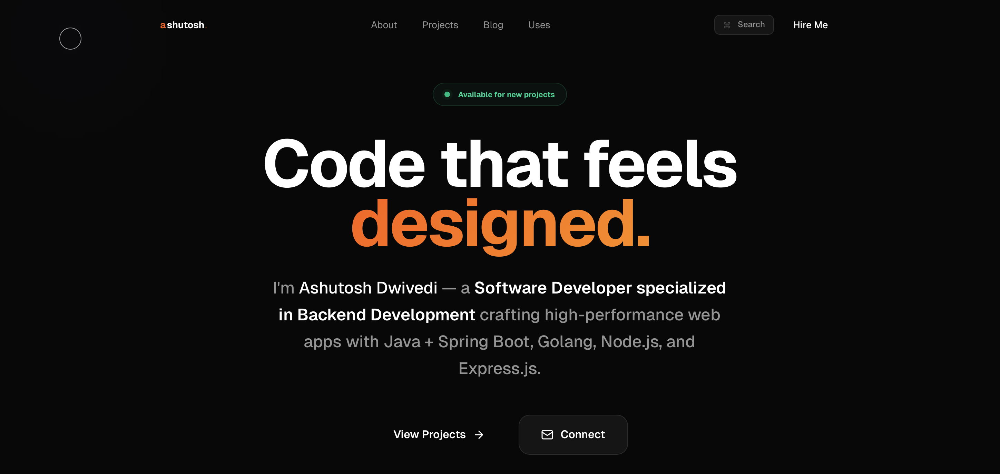
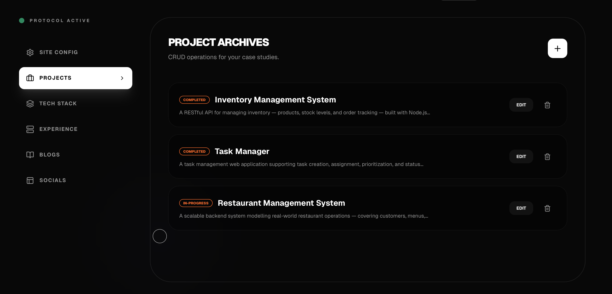
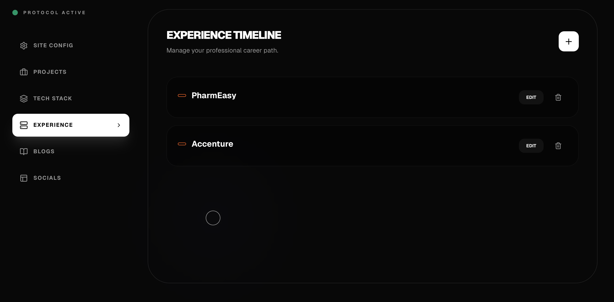
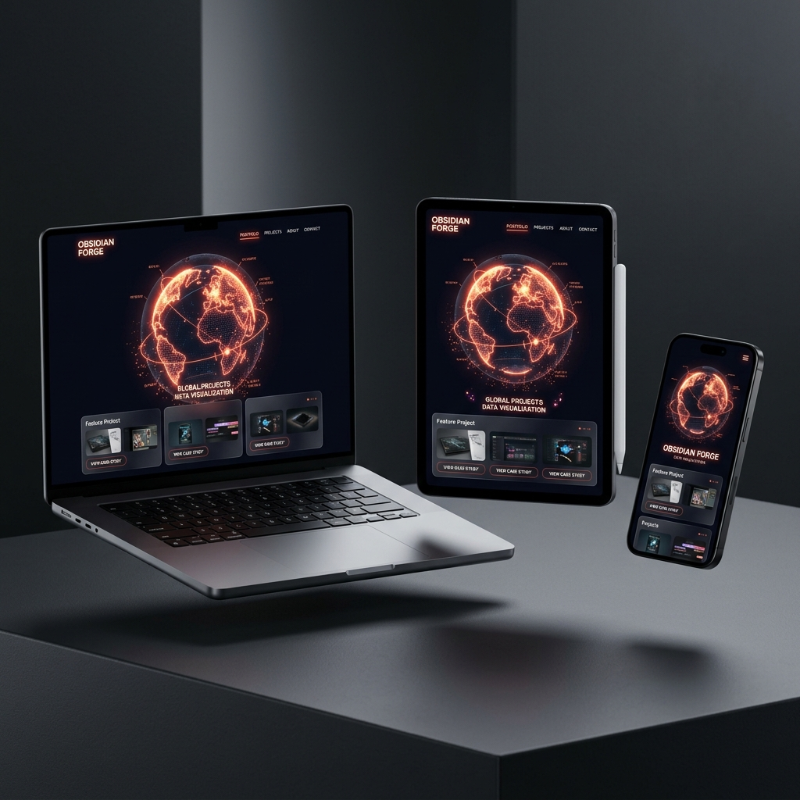

<div align="center">


# 🌑 Ashutosh Dwivedi - Portfolio


---

[](https://github.com/akdwivedi-explorer/Portfolio/stargazers)
[](https://github.com/akdwivedi-explorer/Portfolio/network/members)
[](./LICENSE)


[View Live Demo](https://github.com/akdwivedi-explorer/Portfolio) • [App Console](https://portfolio-frontend-eosin-one.vercel.app/admin) • [Report Bug](https://github.com/akdwivedi-explorer/Portfolio/issues)

</div>

---

## 📖 Table of Contents

- [✨ Key Features](#-key-features)
- [💻 Tech Stack](#-tech-stack)
- [🖼️ Visual Showcase](#%EF%B8%8F-visual-showcase)
- [📈 Project Analytics](#-project-analytics)
- [🚀 Quick Start](#-quick-start)
- [🔐 Admin Access](#-admin-access)
- [🏗️ Deployment](#%EF%B8%8F-deployment)
- [📜 License](#-license)

---

## ✨ Key Features

- 🌍 **Immersive 3D Experience**: Interactive globe visualization for global project distribution.
- 🛠️ **Microservice Architecture**: Decoupled Next.js frontend and Spring Boot Java backend.
- ⚡ **SEO Optimized**: Built with Next.js 16 App Router for lightning-fast performance and meta-tags.
- 🎨 **Obsidian Forge Aesthetic**: A premium dark-themed design with liquid-core animations.
- 🛡️ **Secure CMS**: Full administrative console with Spring Security integration.
- 📦 **Infrastructure Ready**: Pre-configured with Docker, Kubernetes manifests, and CI/CD pipelines.

---

## 💻 Tech Stack

<div align="center">

[](https://skillicons.dev)

</div>

---

## 🖼️ Visual Showcase

<div align="center">

### 🚀 Landing Experience



### 🛠️ Integrated CMS (Protocol)





### 📱 Responsive Precision



*Engineered to look stunning on every screen, from iPhone to MacBook Pro.*

</div>

---

## 📈 Project Analytics

<div align="center">


</div>

---

## 🚀 Quick Start

<details>
<summary><b>Approach 1: Using Docker Compose (Recommended)</b></summary>

```bash
# Spin up PostgreSQL, Spring Boot Backend, and Next.js Frontend
docker-compose up --build
```
- **Frontend**: [http://localhost:3000](http://localhost:3000)
- **Backend API**: [http://localhost:8080/api/v1](http://localhost:8080/api/v1)
- **Database**: `localhost:5432`
</details>

<details>
<summary><b>Approach 2: Manual Development Setup</b></summary>

1. **Database**: Start PostgreSQL on `5432` with database `portfolio`.
2. **Backend**:
   ```bash
   cd backend && ./mvnw spring-boot:run
   ```
3. **Frontend**:
   ```bash
   cd frontend && npm install && npm run dev
   ```
</details>

---

## 🔐 Admin Access
Navigate to [https://portfolio-frontend-eosin-one.vercel.app/admin](https://portfolio-frontend-eosin-one.vercel.app/admin).

> [!SECURITY]
> The default administrative credentials have been removed from the documentation for security. Please refer to your local `.env` or system administrator for login details.

---

## 🏗️ Deployment

This project is built for high-scale, zero-cost cloud environments.

- **Frontend**: [Vercel](https://vercel.com/) (Next.js Optimization)
- **Backend**: [Render.com](https://render.com/) (Docker Support)
- **Database**: [Neon.tech](https://neon.tech/) (Serverless PostgreSQL)

---

## 📜 License
This project is licensed under the MIT License - see the [LICENSE](./LICENSE) file for details.

---

<div align="center">
  <h3>Show some ❤️ by starring this repository!</h3>
  
</div>
